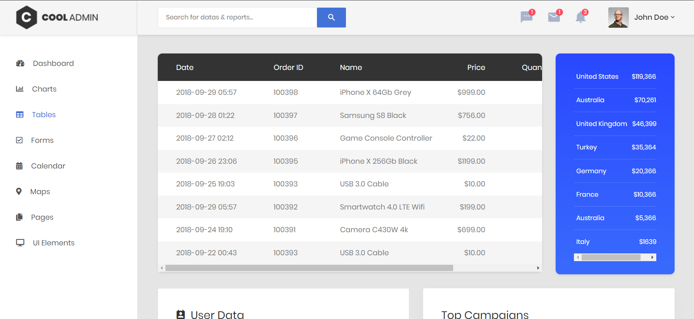

<!-- ## Screenshots

 -->

# Expense Tracker

## Overview

Expense Tracker is a web-based application designed to help you manage your finances efficiently. Track your expenses, categorize your spending, and visualize your financial health with ease.

## Features

- **Dashboard**: Get an overview of your financial status.
- **Expense Management**: Add, edit, and delete expenses.
- **Category Management**: Organize expenses into categories.
- **Reports**: Generate reports to analyze spending patterns.
- **User Management**: Manage user accounts and profiles.

## Screenshots

### Dashboard


<!-- ### Add Expense


### Expense Report

 -->

## Installation

1. **Clone the Repository**:
   ```bash
   git clone https://github.com/AnoopVL/Expense-Tracker.git
   ```
2. **Navigate to the Project Directory**:
   ```bash
   cd Expense-Tracker
   ```
3. **Install Dependencies**:
   - Ensure you have PHP, MySQL, and a web server (e.g., Apache) installed.
4. **Setup Database**:
   - Import the `expense.sql` file into your MySQL database.
5. **Configure Database Connection**:
   - Update `config.php` with your database credentials.
6. **Run the Application**:
   - Start your web server and navigate to the project directory in your browser.

## Development

- **Languages**: PHP, JavaScript, HTML, CSS
- **Database**: MySQL

## Contributing

Contributions are welcome! Please follow these steps:

1. Fork the repository.
2. Create a new branch (`git checkout -b feature-branch`).
3. Make your changes and commit (`git commit -m 'Add some feature'`).
4. Push to the branch (`git push origin feature-branch`).
5. Create a new Pull Request.
